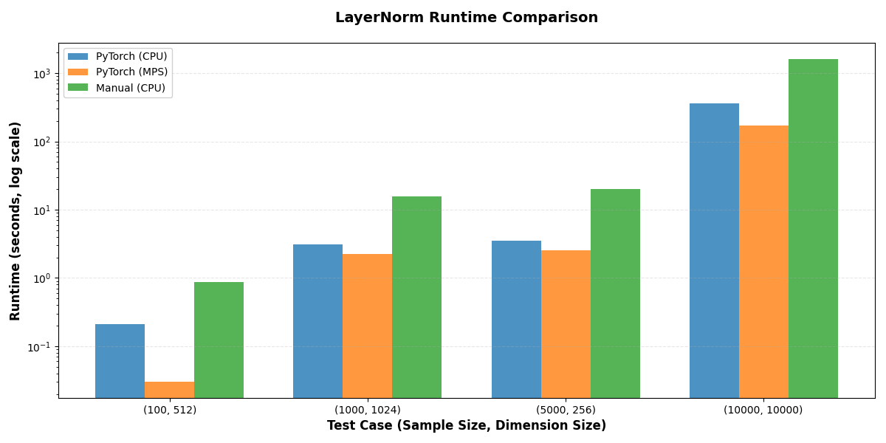

# High-Performance PyTorch LayerNorm via C++ Extension

## Overview

This project implements a high-performance Layer Normalization operator as a custom PyTorch C++ extension. It integrates forward and backward passes with PyTorch autograd, benchmarks performance against CPU and MPS backends, and is designed with a backend-agnostic architecture for future CUDA support. The goal is to gain hands-on experience with PyTorch internals, Python-C++ integration, and efficient neural network operator design.

## Dependencies

- Python 3.10+ (tested with Python 3.14.2)
- PyTorch 2.9.1+ (with MPS support for Apple Silicon)
- Xcode Command Line Tools (for compiling C++ extensions on macOS)
- Ninja (build system for faster compilation)
- CMake (optional, for building unit tests)

For an easy setup, install all dependencies from the [requirements.txt](requirements.txt) file into a virtual environment (`venv`) using `pip`:

```sh
python -m venv venv
source venv/bin/activate
pip install -r requirements.txt
```

## Setup

Install Python dependencies:
```sh
pip install torch torchvision torchaudio --index-url https://download.pytorch.org/whl/cpu
pip install ninja
```

Install Xcode Command Line Tools (macOS):
```sh
xcode-select --install
```

The extension is automatically compiled on first import. When running scripts from the project root directory, import as:
```python
from py.autograd import LayerNorm
```

For unit tests, build with CMake:
```sh
mkdir build && cd build
cmake ..
make
```

## How to Run (Simple Test)

To run test cases with the custom C++ PyTorch LayerNorm extension, use the [main.py](main.py) program. Adjust the test cases if needed, review the comments to understand the code flow, and run it. The terminal will display output for each test case and whether it passed. This program evaluates the custom extension against the built-in PyTorch LayerNorm, including the forward pass, loss computation, and gradients through the backward pass. Feel free to modify and add new test cases!

```sh
python main.py
```

## Project Structure

- **[cpp/](./cpp/)** - Baseline C++ implementation of LayerNorm forward and backward passes. Contains the unoptimized version used for initial development and testing.

- **[optimized/](./optimized)** - Optimized C++ implementation with loop fusion, improved memory access patterns, and reduced allocations. This is the production-ready version. Also includes stubbed CUDA files (`.cu`) for future GPU support.

- **[py/](./py/)** - Python scripts for testing, benchmarking, and visualization. The [autograd.py](./py/autograd.py) file loads the C++ extension and wraps it in a PyTorch autograd function. Use [runtime.py](./py/runtime.py) for performance benchmarks and [graphs.py](./py/graphs.py) for generating visualizations.

- **[tests/](./tests/)** - Comprehensive test suite including unit tests for forward/backward passes, CPU vs MPS comparisons, memory access optimizations, and minimal extension examples. Build with CMake to run C++ unit tests.

- **[docs/](./docs/)** - Documentation files covering implementation notes, performance results, CUDA architecture, and development notes for each phase of the project.

- **[media/](./media/)** - Screenshots, graphs, and visualizations showing runtime comparisons, code examples, and test results. A lot taken from the updates posted on LinkedIn incase anything ever needs to be references.

## Progress Timeline

**Planning - Thought of Idea** | Dec 24-25, 2025 [Started]
Wanted to work on a project that would provide deep learning opportunities after my co-op at Lockheed. Realized that ML projects typically use higher-level layers, and building custom extensions for BatchNorm and LayerNorm functions in PyTorch would be an excellent way to combine C++ learning with existing Python and PyTorch knowledge. Started building test functions immediately while learning, which is why the [tests/](./tests) directory contains extensive test coverage.

**Phase 0 - Environment Setup** | Dec 26-29, 2025 [Done]  
Got PyTorch C++ extensions working. Set up Xcode command line tools and got a simple extension compiling. Tested basic tensor operations and element-wise functions.

**Phase 1 - Python Baseline** | Dec 27, 2025 [Done]  
Built LayerNorm forward and backward in Python. Learned that LayerNorm normalizes across features, not batches. Unit tests pass against PyTorch's built-in LayerNorm.

**Phase 2 - C++ Forward Pass** | Dec 30, 2025 - Jan 2, 2026 [Done]  
C++ forward pass working. Learned how to use torch::Tensor and memory access patterns. Created unit tests with Catch2 framework and Python bindings.

**Phase 3 - Backward Pass + Autograd** | Jan 4-15, 2026 [Done]  
Built backward pass in C++ and registered with PyTorch autograd. Fixed bugs with tensor dimensions and gradient computation. Unit tests verify correctness against built-in PyTorch.

**Phase 4 - CPU Optimization** | Jan 16-18, 2026 [Done]  
Fused loops in forward and backward passes. Removed unnecessary tensor allocations. Calculated baseline runtime and improved memory access patterns.

**Phase 5 - Backend Comparison** | Jan 17, 2026 [Done]  
Created unit tests comparing CPU vs MPS performance. Benchmarked element-wise functions and LayerNorm to measure framework overhead.

**Phase 6 - CUDA Design** | Jan 18-22, 2026 [Done]  
Researched CUDA API design and created architecture documentation with stubbed CUDA files. Not implementing CUDA (lack of driver), but preparing the structure in case of future work adding it to this project.

**Extra - Clean Up Repo** | Jan 23-25, 2026 [Current]
Project is complete. Cleaning up the repository to better showcase the work and learning, especially in case others want to build upon it.

---

## Some Screenshots / Graphs / Tables Throughout the Project

### Runtime Comparison for CPU vs. MPS with PyTorch LayerNorm



### CPU vs. MPS Runtime Results Table (Forward + Backward)

Two result groups, each from different cases, with smaller tensors favoring CPU due to the low overhead and quick access for low-level computations, and the MPS being the faster device during larger workloads and groups of samples.

**CASE: (100, 512)**

| Metric | CPU | MPS | CPU |
|--------|-----|-----|-----|
| Operation | PyTorch LayerNorm | PyTorch LayerNorm | Manual LayerNorm |
| Median (ms) | 0.213 | 1.00 | 0.868 |
| IQR (ms) | 0.01 | 0.03 | 0.037 |
| IQR Range | 0.21 - 0.22 | 0.99 - 1.02 | 0.852 - 0.890 |
| Iterations | 4572 | 977 | 1132 |
| Improvement % | - | -369.48% | - |

**CASE: (10000, 10000)**

| Metric | CPU | MPS | CPU |
|--------|-----|-----|-----|
| Operation | PyTorch LayerNorm | PyTorch LayerNorm | Manual LayerNorm |
| Median (ms) | 363.74 | 171.04 | 1620.00 |
| IQR (ms) | 28.45 | 1.08 | 10.00 |
| IQR Range | 358.04 - 386.49 | 170.55 - 171.63 | 1620.00 - 1630.00 |
| Iterations | 12 | 6 | 4 |
| Improvement % | - | +52.98% | - |

### Runtime Results Table for Forward vs. Backward Pass (Manual vs. PyTorch)

Results from comparing the custom C++ extension autograd function to the built-in PyTorch one, with the optimization results also displayed after applying some cache locality and loop fusion techniques.

## Forward Pass

| Test Case | PyTorch (seconds) | Manual Baseline (seconds) | Manual Optimized - (seconds) | Improvement |
|-----------|--------------|---------------|-------------|-------------|
| (100, 512) | 0.0000 | 0.0004 | 0.0003 | +25.0% |
| (1000, 1024) | 0.0004 | 0.0080 | 0.0062 | +22.5% |
| (5000, 256) | 0.0006 | 0.0103 | 0.0077 | +25.2% |

## Backward Pass

| Test Case | PyTorch (seconds) | Manual Baseline (seconds) | Manual Optimized (seconds) | Improvement |
|-----------|--------------|---------------|-------------|-------------|
| (100, 512) | 0.0001 | 0.0009 | 0.0005 | +44.4% |
| (1000, 1024) | 0.0019 | 0.0222 | 0.0094 | +57.7% |
| (5000, 256) | 0.0022 | 0.0244 | 0.0115 | +52.9% |

## Dev Background

**Rikhil Amonkar | CS @ Drexel University**
- **Experience**: ML Engineer Co-op @ Lockheed Martin | AI Research Engineer @ Drexel University
- **Contact**: rikhilma@gmail.com
- **LinkedIn**: [rikhil-amonkar](https://www.linkedin.com/in/rikhil-amonkar/)